# Sure Password

  

 

<h1 align="center">Hi , Welcome to Sure Password </h1>

  <em>
    Sure Password is a password manager made in python which stores passwords of multiple users for various applications in encrypted form and decrypts them when needed. It is implemented using cryptography package in python. 
 
  </em> 

  
 ---
 
 ### Team Members
 #### 1. Rushabh Gandhi: 1911012
 #### 2. Nayan Mandliya: 1911027
 #### 3. Hussein Motiwala: 1911031
 
---
 
 ### Instructions to run
 * Install virtual environment using the following command
 
 pip install virtualenv

* Create new virtual environment

python -m venv <name_of_your_environment>

* Activate your virtual environment

<name_of_your_environment>\Scripts\activate.bat

* Install project dependencies

pip install -r requirements.txt

* Run the server inside project folder and go to the url that appears on your command prompt

python manage.py runserver

---

### Features of Sure Password
* User registration/login. 
* Storing passwords. 
* Encrypting/decrypting passwords. 
* Updating passwords. 
* Deleting passwords. 
* Deleting user.

---

<h2 align="center">
Snapshots of the project
</h2>
  

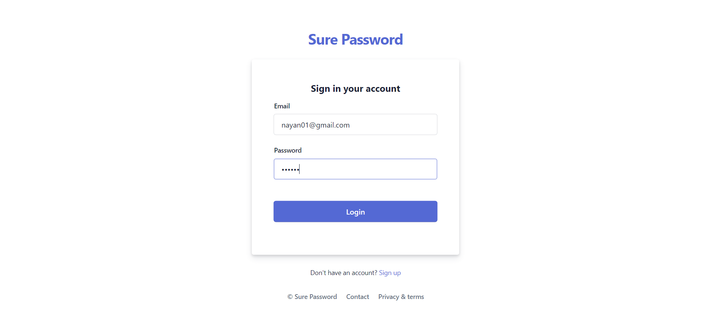

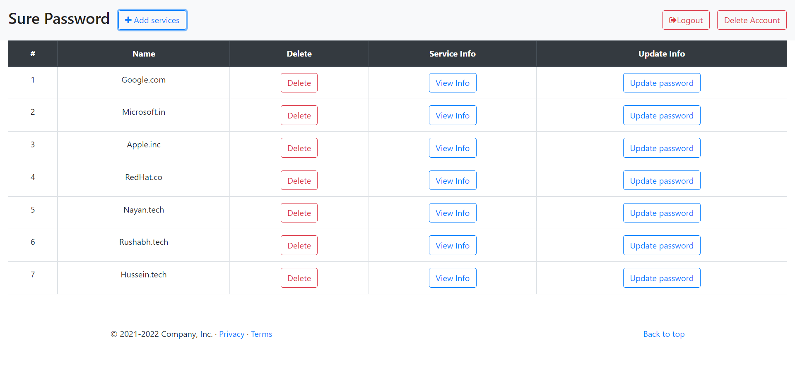
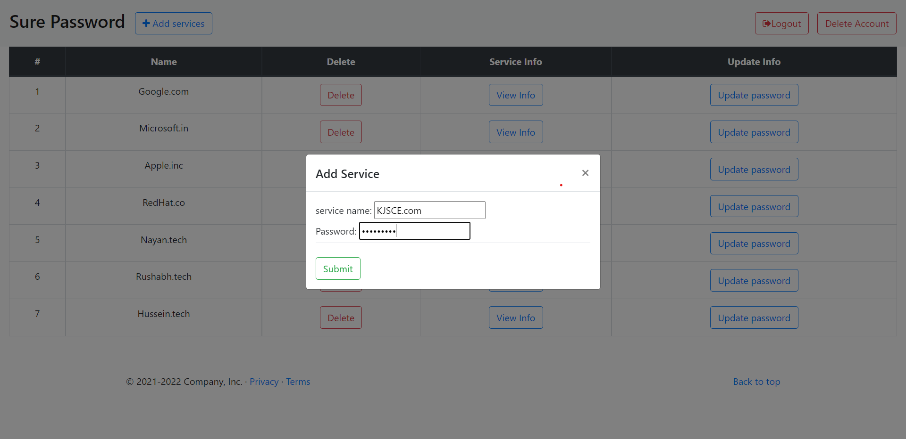
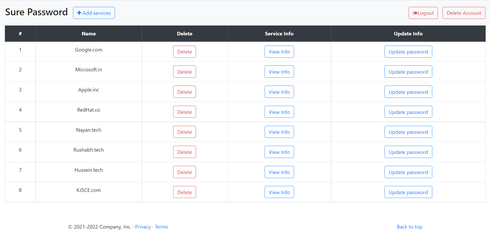

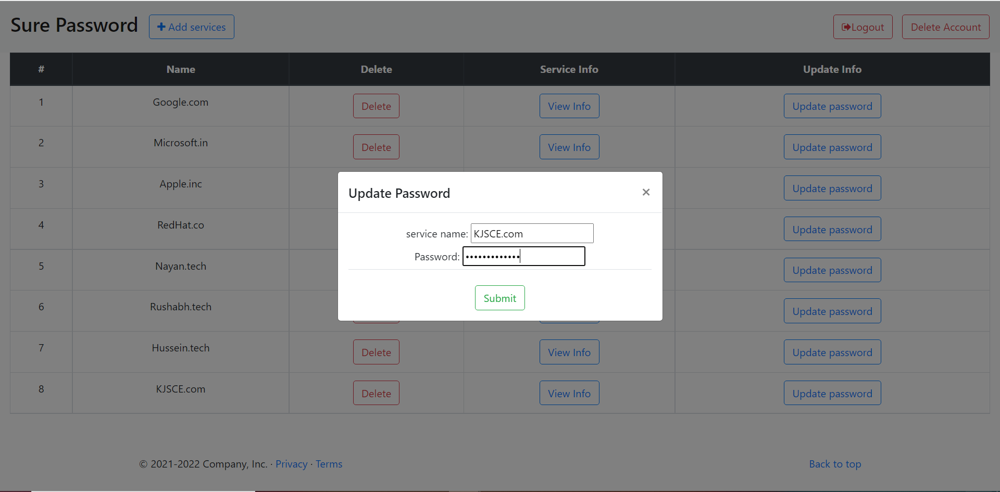

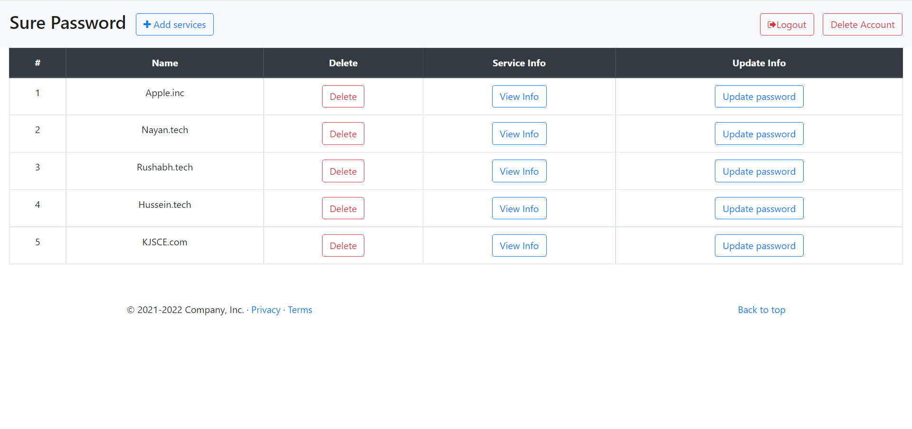
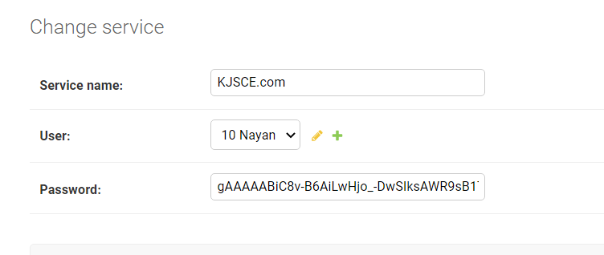
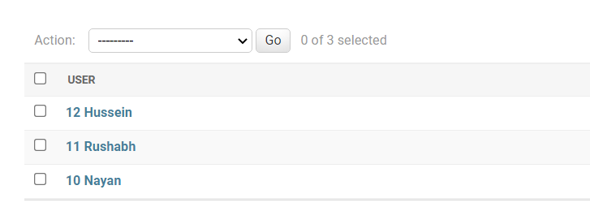
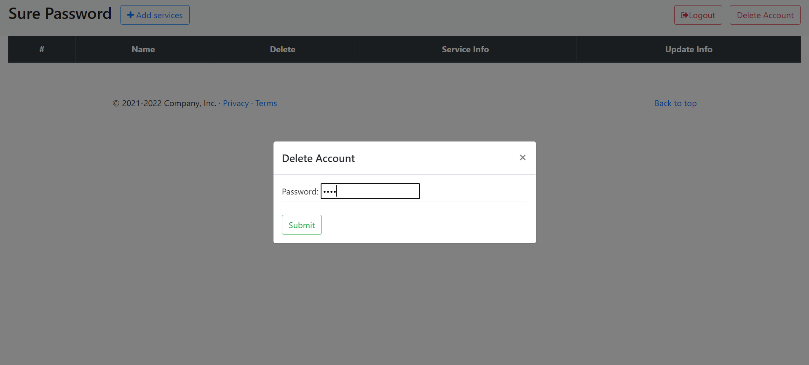
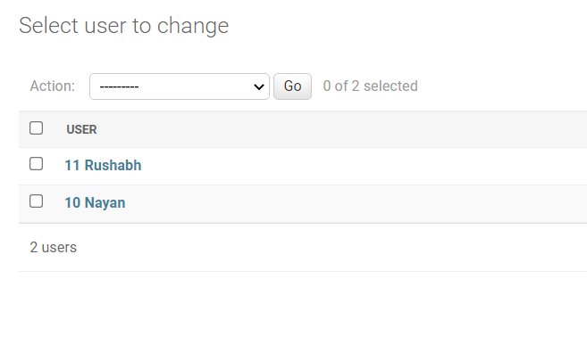
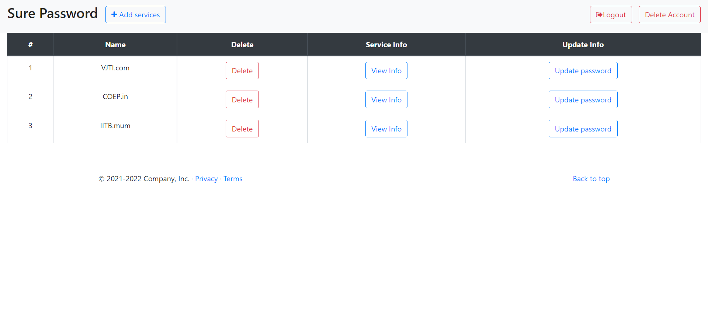
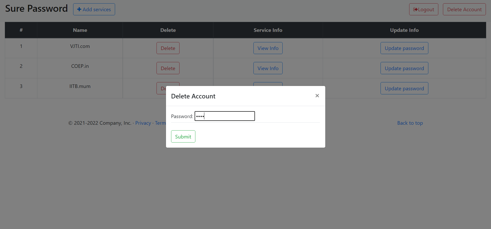
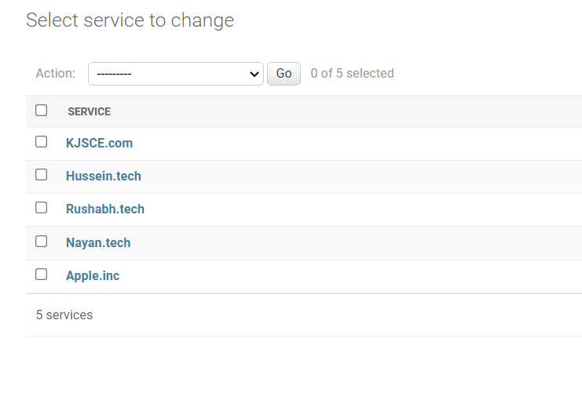
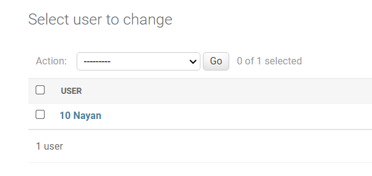
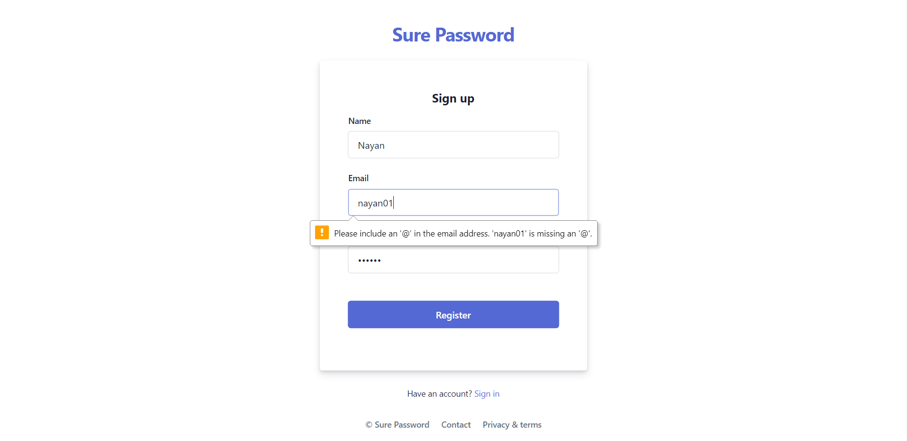

---

<h3 align="center"><b>Developed with :heart: by <a href="https://github.com/rushabhgandhi13">Rushabh Gandhi</a>, <a href="https://github.com/nixen2802">Nayan Mandliya</a>, <a href="https://github.com/hussein-hub">Hussein Motiwala</a>.</b></h1>
